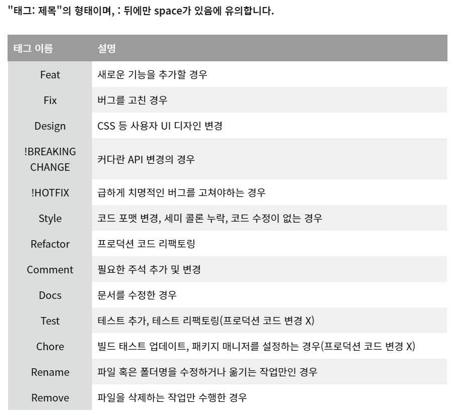

# 42WORLD

# 소개

42서울 재학생과 졸업생이 교류하는 온라인 커뮤니티 제작 프로젝트입니다.

이 저장소에는 **프론트엔드 소스코드**가 저장되어 있고, 백엔드 소스코드는 [이곳](https://github.com/42-world/42world-Backend)에서 볼 수 있습니다

## 커뮤니티 둘러보기

https://www.42world.kr/

# 프로젝트 시작방법

`npm install` (혹시나 안되면 `npm ci`)
`npm start`

# 설정들(우리들의 약속 ㅎㅎ)

`srfc` 를 입력하고 엔터를 치면 스닙페이스트 됩니다.
혹시 안되면 저에게(TonyHan(chahan)) 연락주세요 :)

Organisms 내부는 여러분이 원하는데로 작성해주세요.

여러분의 스타일을 존중합니다.

대신 구조만 큰 `styled-component`를 만들고 그 내부는 className으로 구분해주세요

컴포넌트는 모두 대문자로 시작합니다.

# 역활 분배

- 메인페이지

jiwchoi, hyeonkim, chahan

- 글목록

sham

- 마이페이지

jiychoi

- 로그인, 회원가입, 네비게이션, 푸터

chahan

- 글쓰기, 글 상세페이지

klim

# 디렉토리 구조

[ public ]

- asset

  - 이미지 파일/동영상 파일

- apis
  - API 통신용

[ src/components ]

- atoms - 재활용되는 디자인

  - 디자인용 styled-compont

- organisms - 재활용되는 컴포넌트

  - 페이지 마다 디렉토리 존재

- pages - 페이지

  - 페이지 안에서만 사용되는 styled-compont는 해당 jsx 파일 내부에서 정의한다.

- contexts

  - 상태 관리용 디렉토리

- datas
  - 목업 데이터

# 임시 배포 위치

[https://festive-engelbart-6556a5.netlify.app/](https://festive-engelbart-6556a5.netlify.app/)

# 개발 순서

- 1. 목업 디자인을 만듭니다.(반응형 고려)
     목업 디자인을 만드는 과정을 alpha라고 부르고
     데이터들은 서버가 아닌 로컬 data 폴더에서 가져와 사용해주세요

- 2. Axios 통신을 구현합니다.
- 3. 세부 기능을 구현합니다.

# 개발 디자인

- Atomic Design

# git push 규칙

# 참고할만한 사이트

[https://pridiot.tistory.com/15](https://pridiot.tistory.com/15)
[https://www.npmjs.com/package/react-pro-sidebar](https://www.npmjs.com/package/react-pro-sidebar)

# 개발팁

jsx 파일안에서 `srfc` 하면 자동으로 styled components 형태로 만들어짐

## 기여한 사람들

| [🍉 chahan](https://github.com/tonyhan18) | [🥝 hyeonkim](https://github.com/hyongti) | [🥭 jiwchoi](https://github.com/blingblin-g) | [🧀 jiychoi](https://github.com/chichoon) | [🥑 klim](https://github.com/Plut0) | [🍍 sham](https://github.com/GulSam00) | [🍑 juchoi](https://github.com/euiminnn) | [🍇 ycha](https://github.com/Skyrich2000) |
| ---------------------------------------- | ---------------------------------------- | ------------------------------------------- | ---------------------------------------- | ---------------------------------- | ------------------------------------- | --------------------------------------- | ---------------------------------------- |

# 기술스택

- "@emotion/react": "^11.7.1",
- "@emotion/styled": "^11.6.0",
- "@mui/icons-material": "^5.3.0",
- "@mui/lab": "^5.0.0-alpha.66",
- "@mui/material": "^5.2.7",
- "@testing-library/jest-dom": "^5.16.2",
- "@testing-library/react": "^12.1.4",
- "@testing-library/user-event": "^13.5.0",
- "@toast-ui/react-editor": "^3.1.3",
- "axios": "^0.26.1",
- "bootstrap": "^5.1.3",
- "dayjs": "^1.11.0",
- "jquery": "^3.6.0",
- "lodash.kebabcase": "^4.1.1",
- "memoize-one": "^6.0.0",
- "qs": "^6.10.3",
- "react": "^17.0.2",
- "react-bootstrap": "^2.2.2",
- "react-circular-progressbar": "^2.0.4",
- "react-dom": "^17.0.2",
- "react-fontawesome": "^1.7.1",
- "react-icons": "^4.3.1",
- "react-player": "^2.10.0",
- "react-pro-sidebar": "^0.7.1",
- "react-router-dom": "^6.2.2",
- "react-scripts": "5.0.0"
- "reactstrap": "^9.0.1",
- "recoil": "^0.7.0",
- "remove-markdown": "^0.3.0",
- "styled-components": "^5.3.3",
- "web-vitals": "^2.1.4"

